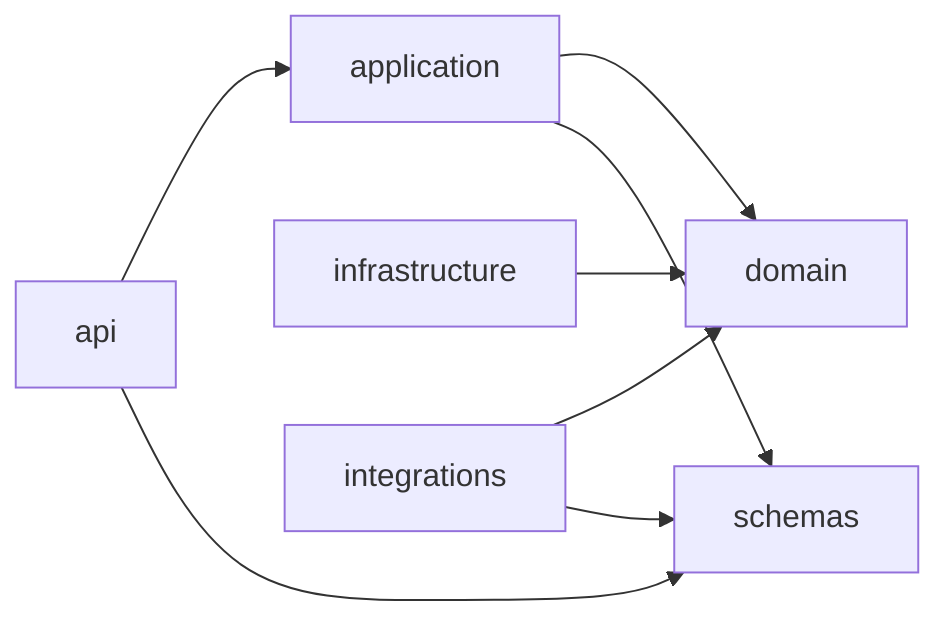
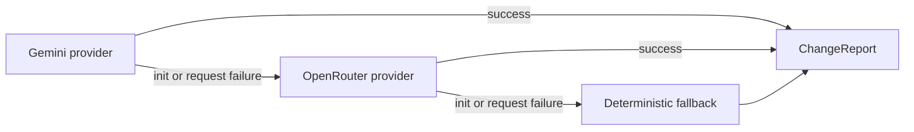

# Architecture

Document Diff Check is organized around dependency inversion. The API layer owns
transport concerns, application use cases coordinate workflows, and domain
services contain deterministic comparison logic. Infrastructure and integrations
implement the ports used by the inner layers.

## Layers

- `api`: FastAPI routes, request parsing, response formatting, middleware, and
  domain-exception to HTTP response conversion.
- `application`: use cases for upload, comparison, and single-document review.
- `domain`: entities, ports, comparison logic, exceptions, and token-budget
  chunking strategy.
- `infrastructure`: DOCX parsing, fallback insights, file-backed repositories,
  and prompt payload construction.
- `integrations`: provider adapters for Gemini and OpenRouter.
- `schemas`: Pydantic API and LLM response contracts.

## Insight Provider Chain

The API builds a resilient provider chain at startup:

Each LLM provider receives token-budgeted batches of changes or document blocks.
Batch reports are cleaned against valid source IDs and merged before returning to
the application layer.
